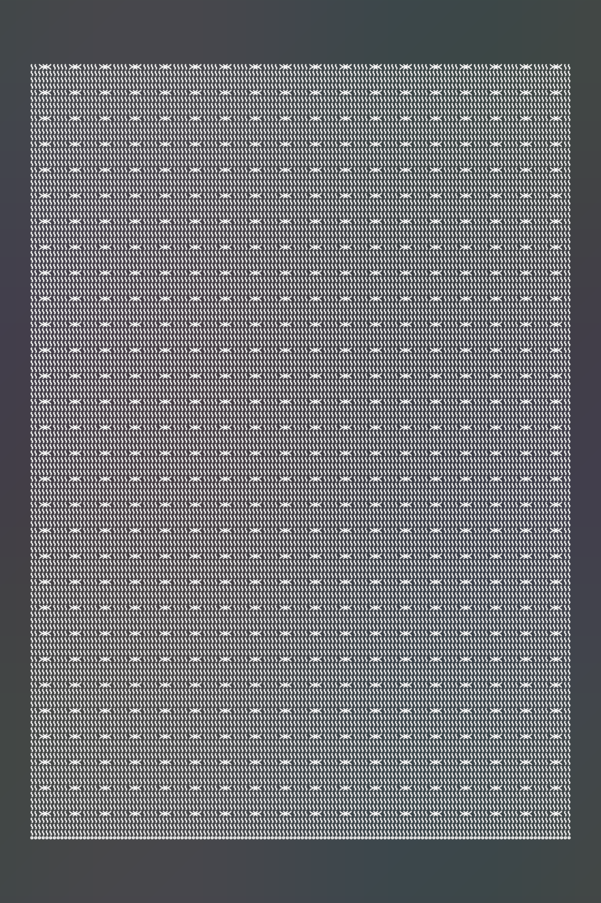

# Visual V2 — product authority before photographic presentation

**Recommendation: REPLACE VISUAL V1's product-redrawing architecture.** Retain its useful CIR, provenance, instruments and photographic criteria. Build a deterministic product renderer and a compositor that gives a generative service no authority over product construction. This is an R&D recommendation, **not a claim that a photoreal, structurally exact Heirloom hero now exists**.

Date: 2026-09-27. Owner: Codex independent Visual V2 lane. Repository: StateFarm91/Project-Money. Branch: `codex/visual-v2-rnd`. Evidence snapshot: `0d42f2fe8f32f437a6bd1afcf8217ec1bd35aa56`. Prior Codex handoff/pack index read at `e6c397656d42406d9da338264f15bb36fadab5cf`. A fresh clone provides an isolated working tree; Claude's checkout and branch were not used for edits. Changes in this lane are confined to this directory. No Build 2 requirement statuses, production source, canonical identity assets or historical gates were changed. No merge, deploy, publish, Etsy interaction or paid API call occurred. **External spend: US$0. Maximum paid spend requested for the next experiment: US$0.**

## 1. Decision and limits

The strong version of the owner's hypothesis is correct as an **authority boundary**: when the product pixels have already been rendered, background generation must not be able to replace them. A local compositing proof establishes that boundary even for a hostile background proposal. It does not establish that the renderer has produced the right crochet or a convincing photograph.

The best technically credible architecture is **B + C**: a semantic product compiler, a reusable library of verified crochet yarn paths/materials, a multiscale physically based product renderer, and protected composition. Use a deterministic scene first. Add generative surroundings only after the product itself passes both structural and photographic gates. Use D only in a restricted material-parameter/texture-space role, never as an unconstrained image repaint.

This differs materially from the old architecture called “C” in [VISUAL_ARCHITECTURE_DECISION.md](../VISUAL_ARCHITECTURE_DECISION.md): that C supplied coarse geometry as suggestions to an image generator. This report's C restores renderer-owned foreground contributions after any generator has run. **A suggested reference is not an enforced product lock.**

Evidence does not prove that all diffusion conditioning must fail, or that deterministic rendering is already good enough. Local ControlNet, tiled conditioning and material-space methods remain untested on this product. Conversely, the existing deterministic geometry programme already tried much more than basic cylinders: Mitsuba, plies, fibres, hair scattering, continuity repairs and drape. Simply changing its renderer to Blender is not the missing invention.

## 2. Evidence method and reproducibility

Read the actual reports, generation runners, reference builders, gate/instrument code, tests, manifests, judge records, Product Truth and available images. [evidence_audit.py](evidence_audit.py) reconstructs raw counts, verdicts, cost fields and provenance into [evidence_reconstruction.json](out/evidence_reconstruction.json). [source_inventory.json](out/source_inventory.json) hashes the scoped evidence and relevant source/tests; an inventory entry means preserved evidence, not a claim that every line or image received manual review.

Primary locations are `research/d`, `e1`, `e2`, `e3`, `e4`, `e5`, `bench1`, `bench2`, `v1grad`; `src/brambleloop/{cir,visual,gateway}`; `products/texture.py`; corresponding tests; [BUILD_STATE](../../BUILD_STATE.md) Visual entries around lines 388–650 and [DECISION_LOG](../../DECISION_LOG.md) D-W6, D-E3–E5, D-B1/B2 and D-V1. Read the later “NOT LOCKED” record instead of treating earlier partial milestones as current certification. This report does not reopen or close Build 2 rows.

Evidence limits:

- V1grad and Bench2 commit half-size generated previews and full-image digests, not all full-resolution generated pixels. Their `gen_preview/INDEX.json` explicitly says so. Preview hashes are checked. A digest cannot reconstruct missing pixels; full-size recorded scores are evidence of the prior measurement, not a fresh pixel remeasurement here.
- E4/E5 expect `research/d/out/sc_draped_presentation3_camera.png`, which is absent in this snapshot. Some presentation images survive as JPEGs; those cannot replace a frozen PNG byte-for-byte. Their complete instrument reruns therefore stop honestly at missing evidence.
- E1 and E2 have much weaker measurement/provenance than the later studies. E2 has no comparable independent gate result in its committed directory. Avoid promoting its attractive outputs to certified success.
- Historical costs are manifest estimates, sometimes usage priced at assumed rates, not audited provider invoices. In particular E5's OpenAI 1.5 costing uses GPT Image 1 rates by assumption. Cached judgement cost fields must not be summed as if they were new calls.
- Windows checkout initially converted committed LF text to CRLF, breaking frozen file hashes. Restored committed bytes in this isolated clone, set local `core.autocrlf=false`, and verified no tracked source delta remained. No historical digest was rewritten to fit this environment.

## 3. Visual V1 reconstruction

The following sequence separates hypothesis, treatment, observation and justified conclusion. “Certified” below always means the gate used in that experiment, not the stricter exact-product claim in this assignment.

| Experiment / raw sources | Hypothesis; provider/model/mode; inputs | Measurements and observed result | Supported conclusion |
|---|---|---|---|
| **Milestone D** — [final sc](../d/out/milestone_d_sc_final.json), [final hdc](../d/out/milestone_d_hdc_final.json), `judge_*`, [report](../VISUAL_MILESTONE_D.md), `visual/{milestone_d,drape,pbr_scene,yarn_construction}.py` | The actual validated 5×5 sc/hdc geometry can drape and look photographic. Local Mitsuba rendering; independent `gpt-5-2025-08-07` photographic judge. Certified points, sphere contact, plies/fibres; later principled sheen, hair scattering, continuity work. | Final measurable locks pass, including stationarity after settle and no point changes into renderer. Both swatches still FAIL five photographic items: natural folds, ordinary imperfection, non-melted yarn, non-synthetic stitch texture, non-sterility; lighting and shadows pass. Recorded final drape roughly 9/19 mm. Judge close-out cost $0.1423. | This particular bounded mechanics/material/staging stack failed. It does **not** disprove physically based textile rendering. Shape locking was an imposed infinite-friction approximation, not calibrated yarn physics. |
| **E1** — [manifest](../e1/out/e1_manifest.json), [measurements](../e1/out/e1_measurements.json), `run_e1.py`, `structural_reference.py`, [decision report](../VISUAL_ARCHITECTURE_DECISION.md) | Can coarse deterministic structure condition a product photograph? Twin-derived basket with two wine stripes; FLUX 2 Pro generation `image_prompt` ×3 plus prompt-only ×2; GPT Image 2 edits ×2 plus hands/distractors ×2. | Nine outputs, $0.22 list. FLUX reference arm loses stripes like no-reference control. GPT outputs visibly retain coarse layout. **Raw C0 stripe detector reports 0**, although prose manually describes stripes; C1 detects two at 0.71/0.38 versus target ~0.70/0.44. No count of the expected 144 top-round stitches; uncalibrated twin blocks the full D specification. | Supports image-edit conditioning for coarse layout only. Not proof of exact gauge, and not four independently certified successes. BFL result applies to that semantic generation dialect, not every BFL editor. |
| **E2** — [runner](../e2/run_e2.py), `pattern_parse.py`, `garment_reference.py`, [structure](../e2/out/structure.json), three manifests under `out/`, `out/v1/`, `out/v2/` | Extend E1 to a purchased cardigan from text-derived shape, not seller conditioning. GPT Image 2 edits; flat lay and front three-quarter reference; hero, lifestyle, generic on-model prompts. | Three + three + two successful calls, $0.09 + $0.09 + $0.06 = $0.24 list. Procedural row lines; declared pocket placement and unspecified text-derived RGB. No E3/E4-style independent quantitative final gate located. | Demonstrates a renderer/generation route and images, not product truth certification. The prompt asks for a generic woman and does not prove the locked canonical model. The earlier proposal also called a different yarn-detail experiment “E2”; the committed `research/e2` is the cardigan experiment. |
| **E3** — [RGB correspondence](../e3/out/e3_correspondence.json), [package correspondence](../e3/out/e3_correspondence_pkg.json), manifests, `correspond.py`, [report](../VISUAL_E3.md) | Can generation repair D realism without changing its certified stitches? GPT Image 2 edits, four RGB-only views then two oblique RGB+mask+normal views of the same geometry. Depth retained for validation. | Aligned IoU ~0.82–0.93; package improves hdc NCC ~0.24→0.59. Where reference counts can be read, five stitches become four or six. Reader cannot count truth on several deterministic references. First arm 3 FAIL/1 UNKNOWN; package both FAIL. SC realism improves; hdc carries reference artefacts. Generation $0.18, judge ~$0.0773, reader ~$0.1738. | Macro alignment is insufficient. Reference defects can become product features. No full structural+realism certification. |
| **E4** — `project.py`, `validate_e4.py`, all `e4*_manifest.json` / validation records, [report](../VISUAL_E4.md) | Does continuous yarn plus projected per-stitch correspondence make the hybrid reliable? Same frozen sc/hdc geometry, GPT Image 2 edits, RGB+mask+normal. Round 2 changes material language; high-fidelity parameter arm is refused; yield arm repeats fixed prompts. | 14 generated images; four additional high-fidelity requests rejected before generation. All testable local regions often pass, while global NCC/pose fails. One sc camera output passes structural subset and seven realism items; 3 of 25 stitches are untestable in that view. Only eight testable in oblique views. Generation $0.42; total about $0.60. | Coexistence is possible on a small visible subset, not repeatability or full hidden topology. A per-stitch silhouette overlap is a presence proxy, not a loop-linkage test. Parameter rejection proves no selectable knob in that tested request, not absence of internal fidelity processing. |
| **E5** — [modes/runner](../e5/run_e5.py), [manifest](../e5/out/e5_manifest.json), [validation](../e5/out/e5_validation.json), `judge_*`, [report](../VISUAL_E5.md) | Is a materially different reachable provider/mode a structure lock? Frozen E4 SC camera; OA1/OA1.5 high fidelity, OA1 mask, BFL Fill/flex/max/Kontext max, Gemini 3 Pro/3.1 Flash. | 21 draws, nine modes. Raw all-seven realism **17/21**, not 18/21. Historical structural+realism: OA1.5 2/4, Gemini 2/8, others zero; no consecutive successes in either best sequence. Refined silhouette aligner improves two outcomes; both old/new values retained. Yarn-edit masks fail badly (IoU ~0.333 / 0.010). $2.5767 generation + $0.224 judge = $2.8007. | Existing API modes are soft constraints. The masks erased/replaced the product region: they do not test protected foreground compositing. Do not extrapolate 5×5-swatch rejection-sampling economics to a full throw. |
| **Commercial Bench1** — [gate records](../bench1/out/bench1_gate.json), [manifest](../bench1/out/bench1_manifest.json), `gate.py`, `reference.py`, [comparison](../bench1/out/comparison.json), [report](../VISUAL_BENCH1.md) | Does pattern→full garment→conditioned hero pass commercially material properties? OA1.5 high fidelity medium (12 draws), Gemini (2). Three reference versions and two presentation prompts. Seller images used for comparison/reader calibration, not generation. | **14**, not twelve total draws. `oa15_hifi_10` is the one gate PASS. Final configuration 1/3; overall 1/14. Gauge fails **11/14**, including nine OpenAI draws. Ref3 fixes a misplaced cuff already in reference. Hero scale ratio 1.30 and reader texture “other”. Gate explicitly accepts `waffle_textured`, `ribbed_all_over`, **`other`**. $3.4451. | Verify the claimed certified hero, but qualify the certification: exact waffle identity was not gated. Neither that hero nor seller photos may define Heirloom's target. |
| **Commercial Bench2** — [gate](../bench2/out/bench2_gate.json), [manifest](../bench2/out/bench2_manifest.json), `star_identity.py`, `reference.py`, [report](../VISUAL_BENCH2.md) | Can a star/hood/button garment pass stronger identity/gauge instruments? Intended OA route unavailable due quota; Gemini 3 Pro 2K ×7; Gemini 3.1 Pro substitute reader/judge; eighth draw fails credit. | Seven image FAILs. Star identity fails 5/7; texture/hood/buttons also fail. A cluster can pass star-lattice proxy and still be wrong texture. Intended OA route never generated; pinned judge never judged. Substitute all-true judgements on draws 1–4 do not certify; later readings unavailable. $1.8278. | No hero. Observed Gemini structure failures and independent account exhaustion both matter. It is too strong to call this either merely a funding blocker or a test of the unavailable intended provider. |
| **Blind Product-only V1 graduation** — [truth](../v1grad/out/product_truth.json), [manifest](../v1grad/out/v1grad_manifest.json), [gate](../v1grad/out/v1grad_gate.json), `run.py`, `reference.py`, `gate.py`, [report](../VISUAL_V1_GRADUATION.md) | Can the best evidenced OA route render a never-made original? Heirloom Cable Throw; frozen CIR-only reference; OA1.5 high fidelity medium, RGB+mask+normal. Whole view, stronger contrast, fidelity wording, folded higher pixel pitch. | **0/16** certified: 15 FAIL + 1 UNKNOWN. Cable gauge fails 12, identity 9, edging 7. Whole-view cable pitch often 1.2–1.8× expected; folded view helps some metrics but not final truth. Stored aggregate records have **7/16 all-seven realism PASS**, with the fold item UNKNOWN on the other nine; prose says eight passes/seven fold failures. $4.369 generation + ~$0.4907 validation; manifest total $4.8598. | The blind claim is supported by input firewall, frozen digests and runner. Repeated structure is lost despite silhouette preservation. The precise root cause is bounded to tested treatments; it does not prove an inherent universal 1024-pixel impossibility. |

### Corrections and interpretive cautions

The high-level user summary is substantially right. Brambleloop derives a useful Product Truth/CIR, can represent its macro structure deterministically, and generators can produce persuasive yarn imagery. Bench1 has one contemporary certified hero; Bench2 and blind Heirloom have none. The critical corrections are:

1. **“Exact product” exceeds the old gates.** Heirloom `gate.EXPECT['cable_column_count']` is `{18}, False`: non-material. Its test explicitly confirms a failed count need not fail the verdict. ±35% pitch tolerance can admit too few columns. Crossing period does not establish crossing location, strand ordering or true post-stitch topology.
2. **New zero-cost adversarial evidence:** unchanged V1 `measure()` passes the reference, a 12-pixel phase-shifted crossing pattern, and a reference with one whole column erased. Each reads 51-pixel column pitch / 44-pixel crossing period, with identity/gauge PASS. See [proof_results.json](out/proof_results.json). This is a limitation of that frequency sub-instrument, **not a claim that every complete downstream reader gate would pass those mutations**.
3. **Product Truth is an authoritative design, not measured reality.** The throw's sc gauge, draw-in, yarn response and height scaling remain uncalibrated. Crossing handedness is unspecified; the old reference declares left pair in front. Preserve that convention visibly, rather than claiming the CIR specified it.
4. **Small derived-pitch inconsistency:** frozen summary gives 4.222 cm from four fpdc row heights. The actual source/reference use three rows of height 1.9 and one crossing row of height 2.0, divided by 18 sc rows/10 cm: **4.27778 cm**. This is only ~1.32%, far smaller than observed generator drift. The probe follows the frozen CIR row schedule and reports both numbers. Nothing in old Product Truth or thresholds is edited. A future instrument correction must be separately reviewed and preserve historical results.
5. **Realism aggregate prose overstates its raw tables.** E5 is 17/21. Heirloom is 7/16 under stored item statuses, with nine UNKNOWN fold items. Verdict arrays sometimes call any non-PASS item a `judge_failure`; that label must not turn UNKNOWN into an observed FAIL. Final no-hero conclusion is unchanged.
6. **E4 prose also retains stale sample arithmetic:** actual manifests give four sc camera, six sc oblique, two each hdc view (14 total); some sections still say 11 sc or seven oblique. Use manifest rows, not those paragraphs.
7. **Fidelity-knob inference needs updating.** Current official OpenAI documentation says GPT Image 2 processes input images at high fidelity automatically and does not take that parameter. Historical rejection remains real; “no `input_fidelity` knob” is not “low-fidelity model”. The same docs describe masks as guidance without exact-shape precision. Neither statement is an exact crochet guarantee. [Official image guide](https://developers.openai.com/api/docs/guides/image-generation)

## 4. Root causes, disproven treatments and unknowns

**Verified mechanisms:** whole-image synthesis has authority over yarn and geometry; its desired material change is coupled to pose, repeated texture and count changes. Sending normals as ordinary pictures does not create a numerical normal constraint. Higher pixel pitch helped but did not close final gates. Reference errors (cut yarn ends; misplaced cuff) were copied faithfully. Some instruments measure aggregate appearance, not exact construction. Missing original pixels limit later reproducibility. The existing certified topology builder has only sc/hdc cells and explicitly refuses unsupported post/cable stitches, so “CIR exists” is not “a complete cable yarn model exists”. See [crochet_topology.py](../../src/brambleloop/visual/crochet_topology.py), [pbr_scene.py](../../src/brambleloop/visual/pbr_scene.py), [correspondence.py](../../src/brambleloop/visual/correspondence.py).

**Do not repeat as if new:** E1's semantic FLUX image-prompt route; D's same bounded rigid-cell material/staging stack; unrestricted repaint to fix fuzz; E3/E4 RGB+mask+normal-as-images; E5's same nine-mode tournament; making the entire yarn mask editable; Heirloom contrast wording/fidelity wording/folded-view prompt sweeps. Those treatments did not reliably meet the requirement. None warrants fresh paid sampling now.

**Not disproven:** exact deterministic rendering in general; native ControlNet-style conditioning; explicit per-stitch/tile controls; topology-correct yarn assets with efficient PBR; background-only generation plus deterministic restoration; learning shader parameters from generic yarn samples; genuine UV-space material synthesis; higher-resolution/multiscale render paths. These need bounded experiments, not favorable assumed yields.

**Still unknown:** exact physical gauge/drape; trustworthy fpdc/bpdc/cable path construction at full-product scale; material realism without product photographs; independent stitch observability under folds; certification yield across product classes; authoritative complete canonical body assets in a fresh checkout; cost at production quality. The proof below closes only layout addressability, local rendering feasibility and composition authority.

## 5. Architecture A — improved constrained generation

Technically distinct options exist beyond the old API treatments:

| Technique | Availability verified 2026-09-27 | Repository / test status | Remaining structural risk |
|---|---|---|---|
| Native edge/depth ControlNet, multiple controls, image-to-image or inpainting | Diffusers documents dedicated conditioning networks, conditioning scale and multiple controls. Local weights/runtime can be added. [Diffusers ControlNet](https://huggingface.co/docs/diffusers/main/en/using-diffusers/controlnet) | No such integration or Heirloom experiment found. No weights downloaded or inference run here. | Learned residual guidance, not equality constraints. Depth preserves gross relief more readily than crochet connectivity; edge maps must resolve each crossing. |
| Normal conditioning, tile conditioning | Original ControlNet 1.1 repo provides NormalBae and Tile models/scripts. [Author repository](https://github.com/lllyasviel/ControlNet-v1-1-nightly) | Could be added locally; not an option silently available on `gateway.images`. | Normal conventions/checkpoint families must match; tile overlap can duplicate, erase or phase-shift repeats. It can sharpen an already wrong texture. |
| Regional image adapters | IP-Adapter docs include image prompting and regional masks. [Diffusers IP-Adapter](https://huggingface.co/docs/diffusers/main/en/using-diffusers/ip_adapter) | Local addition, not in current product path. | Embedding similarity and regional attention do not enforce exact counts or canonical identity. |
| Inpainting around foreground + restore | Diffusers has explicit masks/inpainting and preservation workflows. [Diffusers inpainting](https://huggingface.co/docs/diffusers/main/en/using-diffusers/inpaint) | Can add locally. Mask-only preservation not trusted; restore after decoding. | Once product restoration is compulsory, this is architecture C. |
| Hosted OpenAI/Gemini editing | Current public documentation describes editing, high-resolution output and references. [OpenAI](https://developers.openai.com/api/docs/guides/image-generation), [Google](https://ai.google.dev/gemini-api/docs/image-generation) | Existing gateway/runners partly support these. No new account/capability probe or paid request here. | No documented exact stitch lock established. Size controls and semantic masks are not native normal/depth constraints. |
| BFL structural APIs | Historical E5 records depth/canny endpoint 404; an older official Canny API page remains discoverable. [BFL legacy Canny documentation](https://docs.bfl.ml/api-reference/tasks/generate-an-image-with-flux1-canny-%5Bpro%5D-using-a-control-image) | Current callable availability **unverified**; do not erase the observed 404 based on a documentation page. | Requires fresh non-generating schema/account verification before any future authorized trial. |

A fair A experiment would use renderer-derived high-resolution edge+depth controls, fixed camera, a low-denoise sweep frozen in advance, identical 18-column truth, overlap aware tiles and every crossing tested. It must retain all failures and test full, detail and thumbnail views. No claim that “ControlNet solved structure” is justified before that. The local GTX 1070 has 8 GB VRAM; model fit, modern Torch/CUDA compatibility and speed on this older GPU are unverified. A CPU/offload fallback may be slow. A is a bounded comparator, not the preferred production authority boundary.

## 6. Architecture B — deterministic procedural product and PBR

Proposed product compiler outputs:

1. A typed semantic graph: cell/operation IDs, row/fabric coordinates, consumed/produced loops, predecessor/post anchors, crossing strand order, material region and assembly seams. Reject unsupported operations; never relabel a cable as hdc.
2. A metric rest layout from the unchanged CIR. Row-height differences and turning direction are explicit. Preserve uncertainty separately from the design's nominal dimensions.
3. A verified yarn-path asset for sc, dc, front/back post and 2×2 crossing, with correct continuity at repeat and row boundaries. Unit coupons verify loop entry, crossings, clearance and non-interpenetration before full-product instancing.
4. A coarse cloth surface for presentation/drape, with material-space stitch coordinates attached. This surface changes pose, not stitch count; Jacobians, strain and fold occlusion are measured. Use a flat pose first. Later anisotropic bending/shear/contact need calibration; a generic cloth preset is not a fabric prediction.
5. Level of detail: yarn curves at visible crossings/edges/details; instanced/baked normal and displacement only when their projected resolution supports the required measurements; subpixel fibres integrated into a shader. Do not simulate every fibre or solve every yarn contact across a blanket to get a hero.
6. A linear product beauty layer, alpha/coverage, physical depth, normals/tangents, albedo/material IDs, cell/crossing IDs, motion/visibility metadata, and a deterministic shadow/indirect-light pass.

Blender Python can construct meshes/curves, materials, cameras and render headlessly. Geometry Nodes can instance paths/fibres and store semantic attributes, but needs version-pinned node graphs and image/geometry tests. Cycles supplies depth, normals, diffuse colour, shadow-catcher, AOV and Cryptomatte passes; Cryptomatte handles multiple objects/partial coverage and is preferable to a color-key segmentation. [Blender pass documentation](https://docs.blender.org/manual/en/4.5/render/layers/passes.html) Command-line operation is supported. [Blender command-line rendering](https://docs.blender.org/manual/id/4.5/advanced/command_line/render.html)

PBR yarn is not just noise on plastic tubes. Separate yarn radius/ply twist, fibre bundles, staple ends/hairiness, anisotropic scattering, occlusion and finite thickness. Cycles' Principled Hair BSDF is a physically based curve shader, with Chiang/Huang models; it does not supply crochet geometry or measured acrylic parameters. [Blender hair shader](https://docs.blender.org/manual/en/4.5/render/shader_nodes/shader/hair_principled.html) Generic yarn sample measurements can calibrate these reusable material assets without a photograph of each finished product.

The literature demonstrates yarn-level modelling/rendering and multiscale routes, but transfer must be explicit. Cornell's stitch meshes and yarn simulation are **knitting**, not a ready-made crochet cable compiler. They support the separation of a garment surface, stitch layout and yarn geometry. [Stitch meshes](https://www.cs.cornell.edu/projects/stitchmeshes/), [Yarn-based simulation](https://research.cs.cornell.edu/YarnCloth/) Cornell's procedural fibre work supports compact yarn models and appearance fitting, not a guaranteed reconstruction from Brambleloop's CIR. [Micron-resolution fabric research](https://www.cs.cornell.edu/projects/ctcloth/)

**Why B could succeed where D failed:** change the missing representation/material/scale abstractions, not just the software. Replace uncalibrated rigid-cell global mechanics as the hero-image bottleneck; preserve its valuable local topology tests. Complete post/cable yarn paths; remove artificial ends; calibrate reusable material response; choose physically consistent presentation; retain exact IDs through LOD and drape. This is substantial engineering with unproven final realism, not a shader preset away from success.

## 7. Architecture C — deterministic product, generative surroundings

For a fixed camera/light solution, let `F` be authoritative straight linear foreground colour, `a` authoritative coverage, and `B` a proposed background. The only allowed composition is:

`C = a * F + (1 - a) * B`

At `a=1`, output equals the original product exactly. At fractional coverage, the foreground contribution and coverage remain unchanged; the background legitimately affects the mixed pixel. Freeze the input layers by digest and verify the output after colour management/export. A mask passed to a generative service is merely a request. **The local compositor enforces the boundary even if the service ignores it.** Use renderer coverage, including fibres and internal holes, not AI segmentation of the product.

Generate or choose a background compatible with the rendered camera, plane, scale and illumination. Render contact shadows and indirect effects from product geometry on a matching scene proxy. The POC backgrounds below are deliberately simple synthetic plates; no shadow synthesis or room integration is claimed. In production, reject duplicate products, yarn-like invented borders just outside the mask, incompatible shadows and occluding props. A guarded silhouette margin prevents accidental edge edits, but does not replace scene review.

Lighting on the product cannot be freely changed while retaining its exact pixels. Choose scene light first and render the product under it, or fit scene illumination and **rerender** from the same certified geometry/material. Lens blur, grading, grain and resizing belong to a deterministic, versioned camera/export stage; they require final structural observability checks. Generative relighting over the product is not silently exempted from truth checks.

C is strong for a product-only hero and flat lay. It cannot turn a flat layer into another side of a throw, invent a physically credible fold, or dress an arbitrary pose without a geometry solution. More backgrounds increase presentation variety; more poses require B.

## 8. Architecture D — localized material photorealization

Two very different proposals should not be conflated:

- **Image-domain yarn repaint:** even an eroded product mask leaves the generator free to create false holes/crossings inside it. Low denoise, high-frequency residual blending and edge locks are not topology proofs; high frequencies carry real stitch boundaries too. E5 is direct negative evidence for whole-yarn-mask replacement. Do not retry that treatment with a new name.
- **Material-domain assistance:** AI proposes bounded albedo microvariation, roughness, fibre statistics or tangential micro-normal maps in yarn-local coordinates. A deterministic shader applies them to fixed geometry. No displacement, opacity, silhouette, cell indexing or strand order is writable. Clamp perturbation scale/amplitude below the smallest certified structural feature; verify detail renders because even albedo can paint a false stitch. This could reduce material-authoring work, but is untested here.

IC-Light's author repository verifies foreground/background-conditioned diffusion relighting exists. It is not a guarantee that crochet pixels or topology remain unchanged; use it only as a lighting proposal or a measured comparator, not final authoritative foreground. Its repository also flags licensing limits on a bundled background-removal component, so code/weight/component licensing must be reviewed before production. [IC-Light](https://github.com/lllyasviel/IC-Light)

Recommendation: D is optional after B has a correct structure. Prefer fitted shader parameters and deterministic microtexture first. There is no evidence that a UV-material generator will supply calibrated acrylic response or certify all seven photographic criteria without testing.

## 9. Architecture E — reusable calibrated swatch assets and material fitting

Instead of either full-product diffusion or full-product yarn mechanics, build a small library of topology-verified crochet repeat assets plus material parameters. Solve/validate one repeating cable unit and its edge/turn variants, then instance it across the entire unchanged CIR with semantic IDs. Use a separate coarse drape layer and view-dependent detail. When useful, fit procedural fibre parameters to generic yarn/swatch measurements under several lights. No purchased finished-product photo or physical Heirloom throw is required to define its design.

This is the practical implementation strategy for B, with a different computational scaling model from D's earlier global swatch solver. It amortizes hard fibre/topology work across products and listing views. It still needs edge transitions, nonperiodic shaping and correct assembly for garments. A local repeat cannot establish full-garment drape, and a photograph of a generic swatch does not magically calibrate every yarn batch.

Other possibilities such as text-to-3D meshes, image-to-3D or generative Gaussian splats have no demonstrated exact CIR correspondence here. They would introduce another invention stage; keep them out of the authoritative product path. A finished physical-product photograph is a possible business fallback, but fails this assignment's never-made-product premise and is not the recommended solution.

## 10. Comparative decision matrix

Ratings describe enforceable properties or observed evidence, not invented certification probabilities.

| Architecture | Construction authority | Photographic evidence | Main unresolved work | Role |
|---|---|---|---|---|
| A: constrained generation | Learned guidance; exact equality not established | V1 providers often realistic; blind full-product certification0/16. Native controls untested. | Count/phase/topology retention; independent visibility; local model fit | Bounded research comparator |
| B: procedural product PBR | Can enforce semantic geometry; correctness depends on verified stitch assets | D failed five photo items; this probe is visibly schematic | Post/cable topology, materials, edges, drape and LOD | Required product authority |
| C: protected product + presentation | Enforces fixed foreground contribution for a fixed render | Composition boundary proven; believable room/shadow integration untested | Matching camera/light/occlusion, scene rejection | Recommended presentation path after B |
| D: localized photorealization | Image repaint unsafe; material-space restrictions can preserve geometry | No verified full-product result | Material limits, false visual stitches, calibration | Optional shader-authoring aid |
| E: reusable crochet assets / fitting | Explicit topology with amortized construction | Related yarn research; no ready cable library here | Verified repeat/turn/seam assets and material samples | Preferred engineering strategy for B |

Recommended pipeline:

```text
Frozen CIR + Product Truth + provenance
    -> independently checked semantic stitch/anchor graph
    -> verified crochet paths, nominal metric layout and material assets
    -> posed surface + attached yarn coordinates + visibility/strain ledger
    -> deterministic PBR foreground, coverage, depth, normals, IDs, shadow passes
    -> structural gate AND photographic gate
    -> optional scene proposal -> camera/light compatibility -> local composition
    -> final exported-image structural/photographic/thumbnail checks
    -> quarantined research artifact; separate owner-controlled production integration
```

Every unsupported stitch, missing authoritative feature, UNKNOWN verdict or unobservable required feature prevents certification. A renderer declaring its own geometry correct is insufficient: source graph correspondence, projected image checks and independent visual assessment are all needed.

## 11. Zero-cost proof: what was actually built

The decisive input is the original **Heirloom Cable Throw**, with no finished-product or seller photograph. [build_probe.py](build_probe.py) imports the frozen design and compiler, verifies the Product Truth hash and CIR fingerprint, and emits all17,424 cells. Its paths are deliberately labelled **schematic carriers**, not a completed crochet construction. This is an incomplete renderer for the original design, not a simplified replacement pattern eligible for certification.

| Property | Measured result | Interpretation |
|---|---|---|
| Source identity | CIR `33da2708f35c`; Product Truth SHA256 `cf3b9d1a9e92cff41ca2e461b9795cecbaa12d42d89ddb47420aad6307d85808` | Frozen input preserved |
| Semantic inventory | 144x121 cells;18 cable columns;540 crossings on rows5,9,...121 | Complete schedule, not complete yarn topology |
| Families | sc144;bpdc8640;fpdc6480;cable cells2160 | No design family removed |
| Nominal layout | Width900mm; summed height1288.8889mm; cable pitch50mm; crossing interval42.77778mm | CIR-derived, physically uncalibrated; frozen summary discrepancy disclosed above |
| Routes | 17,424 separate carriers;18 points each;313,632 points | Cross-pair routing only; disconnected yarn FAIL |
| Independent schedule/route checks | Eight assertions PASS; five deliberately wrong variants rejected | Deleted column, wrong crossing row, wrong family, moved crossing and altered gauge each FAIL |
| Renderer | Blender4.5.0 CyclesCPU,8threads,32samples,no denoising;1024x1536 | No external service; orthographic flat pose |
| Latency | Latest setup+render14.198s; earlier run peak~1.22GB | One schematic scene; not a production estimate |
| Data | RGBAbeauty; EXR depth, normals and diffuse colour; PNG previews | PNG pass previews are display-transformed, not calibrated data |
| Protected composition | Three backgrounds;12,008 opaque pixels;zero changed opaque pixels;684,367 partial-coverage pixels | The latter change with background under fixed foreground/coverage; not byte-identical whole-product pixels |
| Adversarial composition | Direct hostile plate alters8,986 opaque positions; restoration prevents this; one-pixel corruption detected | Mask compliance by a generator is unnecessary for opaque restoration |
| Old frequency instrument | Reference,12px phase shift and one erased column allPASS | Exact count/phase require additional instruments |

Scripts and raw records: [renderer](render_probe.py), [verifier](verify_probe.py), [geometry manifest](out/geometry_manifest.json), [render record](out/render_record.json), [proof results](out/proof_results.json), [experiment ledger](EXPERIMENTS.md). Raw `.npz`, `.blend` and `.exr` files are regenerable and ignored to avoid committing large intermediates. The verifier binds results to the current beauty and geometry hashes; source inventory is refreshed from canonical repository bytes.



**Separate verdicts:** continuous yarn topology FAIL; stitch/fabric identity, edge/turn construction, physical gauge, fibre/fuzz, material realism and drape UNKNOWN; all-product truth UNKNOWN; photographic certification UNKNOWN; listing-thumbnail suitability FAIL by visual inspection of the schematic carriers. No independent paid photographic judge was called. Silhouette/colour are renderer inputs, not independently certified product-image passes. The image has no marketing approval.

This proof demonstrates full schedule addressability, useful render speed, data-pass availability and a defensible composition boundary. It **does not** demonstrate that B+C already achieves a structurally exact commercial image. It also does not yet test float-EXR compositing, contact shadows, realistic backgrounds, yarn self-collision, fibre coverage or folded-product measurement. Those limits prevent the common mistake of promoting a technical rendering demo into a product certification.

## 12. Decisive next experiment and exact acceptance

**Next question:** can a topology-correct cable fabric produce sufficiently realistic authoritative product pixels without diffusion repaint? Answer this before paying for another background or provider trial.

One bounded experiment, with two dependent stages:

1. Build and independently inspect one **actual Heirloom repeat coupon**, including sc foundation, bpdc/fpdc anchors, the2x2 cable crossing, plain-to-crossing transitions, and turning/edge cases. Use the original stitch registry and metric assumptions. Establish one continuous maker-yarn graph with loop-entry/post-wrap order and no cut ends except declared yarn ends. The existing schematic curves are disposable diagnostics, not an approved asset library.
2. Only after coupon correctness, instance the unchanged full144x121/18-column throw. Predeclare three views (whole flat lay, magnified crossing+edge detail, controlled shallow fold) under two deterministic lighting setups: **six renders**, retaining all outputs and failures. Render at enough resolution that every required feature is measurable in at least one declared view; resolution is an experiment variable recorded before rendering, not a way to excuse missing cells. Add three backgrounds per render through the compositor, including a hostile proposal, for18 composition cases. Use no AI product repaint and no finished-product image.

Acceptance is conjunctive; UNKNOWN blocks advancement:

| Gate | Exact criterion |
|---|---|
| Provenance / identity | Frozen Product Truth hash and CIR fingerprint match; every source cell and operation accounted for exactly once. No extra/omitted feature, edge band or colour region. |
| Count and pattern | Exactly18 cable IDs and540 specified crossings; no extra crossing row; rows5+4k for k0..29. Exact sc/bpdc/fpdc/cable inventory. Actual yarn connectivity and post attachment agree with a separately reviewed stitch construction, not just integer labels. |
| Position / gauge | Nominal900mm width and registry-derived1288.8889mm height; original50mm cable pitch and actual row schedule. Rest-coordinate numerical error≤1e-6 of the corresponding dimension, a floating-point tolerance only. No rescaling to make an image pass. Record old4.222cm and registry4.27778cm crossing summaries; do not silently rewrite either. |
| Crossing topology | Both pairs cross at the prescribed slots; declared front/back order and continuity checked. The direction convention remains explicitly unconfirmed as product intent until authoritative design clarification; do not claim fully specified identity from an omission. |
| Yarn / edges | No undeclared breaks, floating yarn, impossible post wraps or unintended interpenetration; foundation/turn/edge construction shown in detail. Any unknown anchor semantics stop stage1. |
| Pose and silhouette | Material-space layout preserved through pose. Camera and projected silhouette agree with renderer geometry/coverage; quantify strain/contact without changing rest gauge. Actual physical dimensions/drape remain UNKNOWN until calibrated. |
| Visible image truth | Independently read all18 columns in whole view; each crossing located against projected source IDs wherever visible. Boundary error≤one output pixel for raster alignment only; no missing/merged cell permitted. Occluded cells require declared visibility metadata plus another view; hidden counts cannot be inferred from an attractive thumbnail. Existing applicable V1 material gates remain necessary but insufficient. |
| Foreground protection | Fixed foreground/coverage digests; exact opaque RGB equality before final camera export. In linear float composition, foreground contribution error≤1e-6 per channel; after export compare against deterministic reference export. Any one-pixel corruption or changed coverage must fail. |
| Photographic criteria | All seven original D items PASS independently: natural folds, realistic light, coherent shadows, ordinary photographic imperfection, non-melted yarn, non-synthetic stitch texture, non-sterile scene. Preserve item meaning and UNKNOWN. A flat view without observable folds cannot by itself pass the complete seven-item hero gate. |
| Additional presentation checks | Twisted/plied yarn and plausible fibre/fuzz at detail; believable material response under both lights; no invented structure in albedo; no disconnected-looking folds/contact shadows; identity/silhouette legible at256px thumbnail. Thumbnail success does not establish stitch count. |
| Repeatability / negatives | Both lighting setups for the folded hero pass every required criterion; other views pass applicable truth checks and disclose unobservable photographic items. All five existing structural negatives plus wrong crossing order, wrong alpha and fake border negatives fail. Preserve every result, not only a selected hero. |

A crochet-literate reviewer and a photographic reviewer should assess the coupon/detail and rendered views independently using the frozen rubric; at this stage local human review requires no API budget. Missing review is UNKNOWN. Automated judge acceptance remains a separate future validation, not a free claim of independence. If no complete view can establish all seven criteria without hiding required structure, the proposed listing set fails.

**Supports B+C:** correct continuous topology, unchanged full truth, at least both predeclared folded hero renders pass all required gates, detail supports yarn realism, and all composition negatives behave correctly. **Refutes this implementation:** correct geometry remains visibly synthetic despite a bounded material/lighting iteration budget, or practical LOD/drape loses observability/topology. Retain B's authority concept but reconsider renderer/material assets; do not secretly restore whole-product diffusion. A failure of one implementation does not prove every deterministic method impossible.

**Paid specification:** provider none; model none; calls0; maximum requested spend **US$0**. Paid generation would not resolve the immediate missing crochet topology. If a later experiment truly needs a provider, specify model/version, purpose, call count, verified unit price and hard cost cap in a new ledger entry, then obtain separate owner authorization before calling it. Do not infer authorization from this report or from historical caps.

## 13. Production economics and operation

The following are planning estimates, not measured promises. Historical generation costs are repository records, not current provider price quotes. Certification yield for B–E is **unknown**, and no credible per-certified-image cost can be stated until yield is measured.

| Path | Implementation estimate | Compute / latency | Marginal cost and yield | Scaling / maintenance |
|---|---|---|---|---|
| A | 1–3 engineer-weeks for native-control comparator and gates; exact-preservation research uncapped | Modern GPU preferred; GTX1070 compatibility/fit unverified. Latency unmeasured. | Hosted V1 blind mean generation$4.369/16≈$0.273 +validation$0.031 per attempt;0 certified, so cost per certified hero undefined. Native local yield unknown. | Model/checkpoint/version sensitivity; retries increase cost; fine-detail and tile drift require per-image rejection. |
| B | Roughly6–12 engineer-weeks for first verified cable/material/LOD pipeline; garment shaping and calibration could add8–16+. Coupon can expose failure much sooner. | CPU proof14.198s; detailed fibres/drape may take minutes or longer. Set provisional target≤5min per listing view on a chosen worker, then benchmark. | No per-call API fee. Electricity, hardware and engineering dominate. Structural repeatability plausible by construction; combined certification yield unknown. | Asset reuse amortizes effort; unsupported stitches fail closed. Version pinning, deterministic graph tests and renderer regressions required. |
| C | 1–3 engineer-weeks for production alpha/depth/shadow/camera pipeline after B; scene matching may take longer | CPU composition plus B render; current verifier~6s includes many checks, not pure composition latency | Zero API dependence with local scene/background library. Optional generated background cost additional and presently unbudgeted. Composition integrity proven; photographic yield unknown. | Cache backgrounds/light rigs. Reject scene incompatibility/occlusion. Reliable batch operation once product and scene gates exist. |
| D | 2–6 engineer-weeks for bounded material-space experiment; uncertain benefit | Local model/GPU optional; deterministic shader runtime after asset baking | No measured cost/yield; reusable maps can amortize generation if ever authorized | False painted stitches, material overfit and licensing; keep parameters constrained/versioned. |
| E | First repeat/edge/material assets are part of B estimate; additional2–4 weeks per substantially new family is a provisional planning allowance | Coupon fitting offline; instances/LOD inexpensive relative to fibre simulation | Upfront asset/calibration cost, amortized over products and views; yield unknown | Good for repeated fabric; shaping, seams and varied yarn types increase asset burden. |

For example, an **assumed**250W worker rendering five minutes at an **assumed**$0.20/kWh uses about$0.0042 electricity/image. This excludes idle time, purchase/amortization, storage, failed renders and labour; it is arithmetic, not a quote or production cost measurement. If per-attempt total cost is `c` and empirically measured certification yield is `y>0`, expected direct cost per certified image is `c/y`; at observed zero yield this estimate is undefined. Do not conceal failed attempts or judge cost.

24/7 autonomy requires pinned assets/runtime, deterministic semantic builds, isolated workers, idempotent job IDs, content-addressed cache, memory/time limits, atomic output publication to an internal quarantine, retained full-resolution passes, a resumable queue, and fail-closed gates. Background services need explicit allowlists and per-job budgets only after authorization. Never rerun a failed paid sample indefinitely. New product/stitch types enter an asset-validation queue. Engineering review remains necessary for unsupported construction and ambiguous design intent.

## 14. Listing views and immutable canonical model

| View | B+C implications / remaining requirement |
|---|---|
| Product-only hero | Render complete product in physically consistent lighting; protected background optional. Full truth and all seven photographic criteria still required. |
| Flat lay | Easiest count/pitch/edge observation; validates nominal layout. Flatness alone leaves fold/drape realism unobserved, not PASS. |
| Detail | Use actual yarn/ply/fibre assets and adequate sampling; no AI enlargement that invents loops. Critical for topology and material gate. |
| Sizing/features | Derive annotations from unchanged nominal truth, clearly distinguish uncalibrated estimates from physical measurements; IDs support feature callouts. |
| Lifestyle | Match camera/lighting/scale and render actual contact shadows. Props/occlusion must not hide required evidence or imply invented product features. Multiple poses require rerendering geometry. |
| On-model | Requires BOTH exact garment and approved canonical person. A locked2D person plate only supports compatible fixed pose/occlusions; arbitrary new poses require authoritative geometry/approved assets and clothing fit simulation. Generative identity adapters are not exact identity locks. |

The local [canonical asset manifest](../../src/brambleloop/visual/assets/MANIFEST.json) must be consulted before use. Approved face imagery does not authorize reconstructing a body; committed older torso/full_v5 assets are marked superseded, and the authoritative complete pack is external. This first pass does not solve or alter the model. Garment drape/contact/body occlusion and skin/hair lighting compatibility are additional engineering gates, not automatic benefits of a blanket renderer.

## 15. Migration and risks

Keep the Visual V1 evidence and production code intact. Implement an isolated V2 semantic adapter and stitch asset contract; import frozen CIR rather than forking the design. Preserve source-to-cell and cell-to-pixel provenance. Add an independently reviewed exact-count/crossing/topology gate next to historical tests; retain old outcomes and document corrections rather than rewriting certification history. Production integration belongs to Claude/Opus or a separately authorized lane.

First qualify the coupon and complete Heirloom. Then qualify additional stitch families, colours, shaping, edges and garment assembly. Only after deterministic product realism passes should optional generative presentation be evaluated. Shadow-run V2 against V1 with fixed products/views and publish all failures internally; predeclare an acceptance matrix before changing any default. Migration is not a merge, deployment or Build2 status change in this assignment.

Principal risks: CIR may omit construction intent; nominal gauge may be physically wrong; repeat assets can look periodic/plastic; fibres and denoising can obscure stitch boundaries; drape can stretch or hide evidence; colour management can corrupt albedo/alpha; partial coverage and translucent fibres complicate strict locking; scene lighting can conflict; canonical assets may be inaccessible; commercial model/asset licences may differ from code licences; high-quality rendering cost remains unmeasured. Semantic determinism does not imply bit-identical stochastic renders across hardware. Pin seeds and geometry, retain exact output hashes and validate product truth independently on each export.

**Final recommendation: REPLACE VISUAL V1's product-redrawing stage.** B+C with E's reusable assets provides the most defensible route to structural authority. Keep A as a genuinely new, bounded comparator and D as optional constrained material assistance. No architecture has yet demonstrated the complete required commercial capability; this first pass establishes the evidence, the authority boundary, and the next falsifiable engineering test.

## 16. Verification and continuation

Existing offline assertions: E1 17,E3 10,Bench1 34,Bench2 42,V1grad40,fabric relief8 =**151 PASS across six suites**. E4/E5 are **blocked**, because their frozen D reference PNG is missing; do not substitute a JPEG. [Raw test summary](out/tests/offline_checks.json). These results do not certify Build2 or this schematic render.

Reproduction commands, environment versions and artifact inventory are in [README.md](README.md). Read [CURRENT_STATE.md](CURRENT_STATE.md) first after compaction; then [DECISIONS.md](DECISIONS.md), [EXPERIMENTS.md](EXPERIMENTS.md) and [NEXT_SESSION.md](NEXT_SESSION.md). Continue this persistent thread from repository memory; a new conversation is not required merely because context compacts.

## 17. Follow-up execution: V2-P06

The stage1 coupon experiment has now run. Four explicit-yarn candidates fail physical clearance; local post winding and source counts alone are insufficient. The routing repair is real, but the DC/chain spatial embedding is rejected and stage2 remains blocked. Construction semantics for the composite cable also need authoritative resolution. See [the executed result](coupon/RESULTS.md), raw measurements and CURRENT_STATE.md. No Product Truth, historical gate or Build2 status changed; paid spend remains$0. This does not certify B+C or disprove deterministic rendering in general.


## 18. Complete persisted-evidence coverage correction (2026-09-27)

The [Claude/Fable audit](evidence_coverage/AUDIT.md) extends the original482-file inventory through Claude4edacff and Git history. Inventory: 768 selected paths / 1003 blob versions at inspected tips, plus four historical depth arrays; 1401 historical path-change entries. All482 prior entries covered. No central D/E1-E5/Bench1/Bench2/V1grad experiment path changed between0d42f2f and Claude4edacff.

The earlier architecture analysis underrepresented Waves2-5, yarn-slip literature, root material/drape artifacts and publishing QA. Corrected evidence: plausible displacement was partly solver instability; frame/force/contact/yarn-mask repairs restored equilibrium but not cloth-like drape; prior best yarn pictures differed from measured topology geometry; actual-strand linkage has closure limitations. Frozen cable direction was already a publishing QA gap. Crochet-specific stitch-mesh/CT literature appears in prior research, but does not supply an independently verified local DC/post/cable asset. See the audit table for source locations and measured numbers.

**REPLACE Visual V1 product-redrawing with B+C remains recommended.** This is not a claim those implementation problems have been solved. Use the prior failures to reject welded-node shortcuts, decorative loop substitutes and disconnected render/certification paths. Latest Build2 changes improve lifecycle/QA wiring, not product pixels. No original threshold, product design or certification status was changed.


## 19. P07 construction instrument increment

The [executed pull-through experiment](pullthrough/RESULTS.md) separates named-loop operations, local spatial passage and complete yarn construction. Two controls pass; seven semantic/four geometric defects are rejected. Whole-bight linking zero is correct even for a local draw-through, so selected strand relations and operation history matter. Separate saved-geometry checks expose13.6mm unaccounted material supply and3mm interstage repositioning. This is not a physically credible DC asset; structure/realismUNKNOWN, emissionBLOCKED. B+C remains the authority architecture, with persistent material state and explicit operation handoff now the next implementation requirement. No paid services or Product Truth changes.
